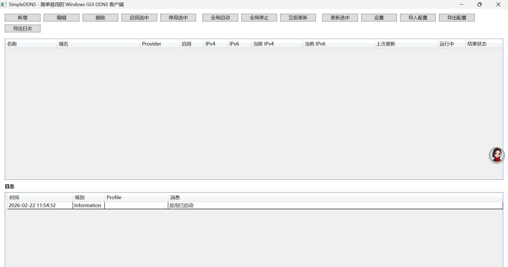
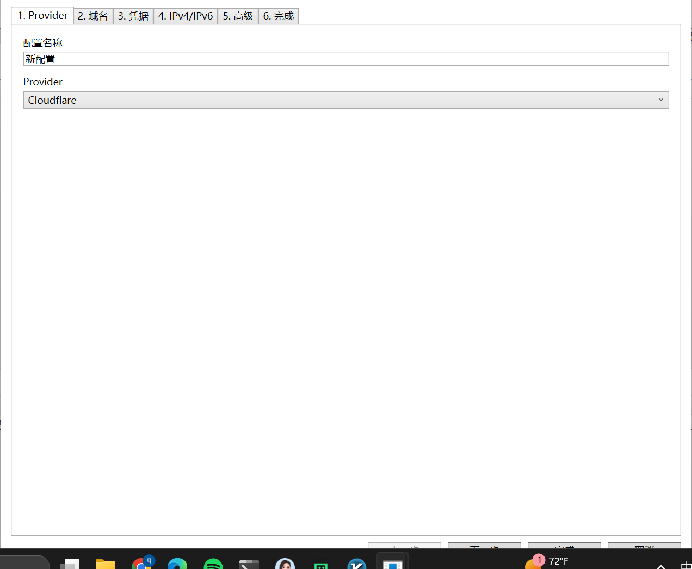
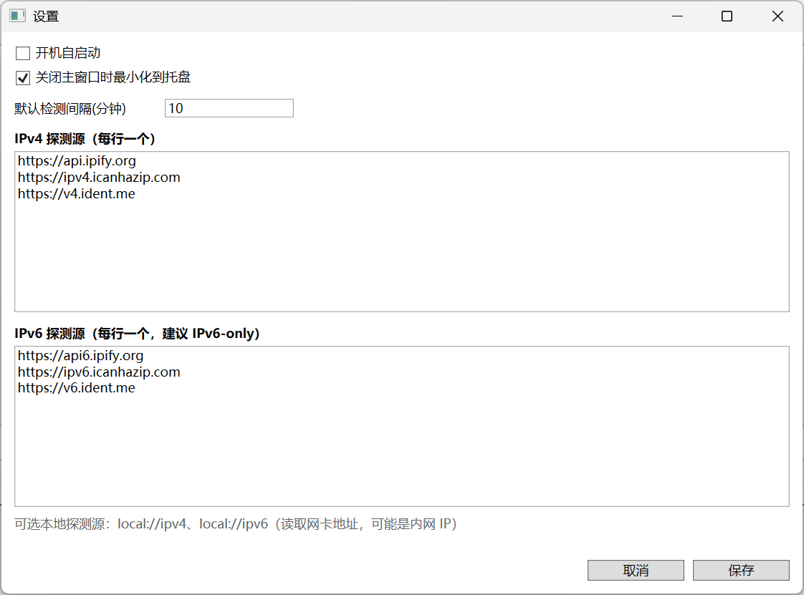

# SimpleDDNS

[中文](README.md) | English

An easy-to-use GUI DDNS client for Windows (WPF / .NET 10).

Designed for regular users: configure once, then click to keep your domain A/AAAA records synced to your current public IP.

## Features

- Multi-profile management: add / edit / delete / enable / disable.
- Providers:
  - Cloudflare (API Token, auto resolves Zone ID by Zone Name, auto create/update A/AAAA).
  - Generic HTTP (URL template, GET/POST, custom headers, JSON body template, test request).
- Independent IPv4/IPv6 probing:
  - Separate probe lists for IPv4 and IPv6.
  - Built-in IPv6-only probe endpoints (3 by default).
  - Local NIC probes: `local://ipv4`, `local://ipv6`.
  - Failure of one protocol does not block the other.
- Update only on change: calls DNS update only when A/AAAA IP changes.
- Stable scheduling:
  - Global start/stop.
  - Per-profile start/stop.
  - Non-concurrent runs for the same profile (`SemaphoreSlim`).
  - Timeout + exponential backoff retry.
- GUI:
  - Main list (name, hostname, A/AAAA toggles, last update, current IPv4/IPv6, status).
  - Wizard (Provider -> Domain -> Credentials -> IPv4/IPv6 -> Advanced -> Finish).
  - Log panel + export logs.
  - Tray menu (open, global start/stop, run now, exit).
  - Close to tray by default (configurable).
- Settings:
  - Start with Windows (HKCU Run, no admin required).
  - Default interval.
  - IPv4/IPv6 probe list management.
- Security:
  - Sensitive fields are not stored in plain text.
  - Encrypted with Windows DPAPI (`CryptProtectData` / `CryptUnprotectData`) in local JSON.
  - Export excludes secrets by default; exporting secrets requires confirmation.
- Chinese UI strings are centralized in `src/SimpleDDNS.App/Resources/Strings.zh-CN.xaml` for future localization.

## Screenshots





## Structure

```text
SimpleDDNS.sln
src/
  SimpleDDNS.App/          # WPF UI
  SimpleDDNS.Core/         # Scheduler, IP probing, template rendering
  SimpleDDNS.Providers/    # Cloudflare + Generic HTTP
  SimpleDDNS.Storage/      # JSON persistence + DPAPI encryption
  SimpleDDNS.Logging/      # Lightweight logging
tests/
  SimpleDDNS.Tests/        # Unit tests
```

## Cloudflare Token Minimum Permissions

Create an API token in Cloudflare:

- Permissions:
  - `Zone.DNS:Edit`
  - `Zone.Zone:Read` (to resolve Zone ID by Zone Name)
- Zone Resources:
  - Limit to your target Zone (e.g., `example.com`).

Do not hardcode the token in source. Fill it in the GUI profile.

## Build & Run

### 1. Build

```powershell
dotnet build SimpleDDNS.sln -m:1
```

### 2. Run

```powershell
dotnet run --project src/SimpleDDNS.App/SimpleDDNS.App.csproj -m:1
```

## Publish (Single-file)

### Framework-dependent (requires .NET Runtime installed)

```powershell
dotnet publish src/SimpleDDNS.App/SimpleDDNS.App.csproj `
  -c Release `
  -r win-x64 `
  --self-contained false `
  -p:PublishSingleFile=true `
  -o publish/win-x64-fdd
```

### Self-contained (no runtime required)

```powershell
dotnet publish src/SimpleDDNS.App/SimpleDDNS.App.csproj `
  -c Release `
  -r win-x64 `
  --self-contained true `
  -p:PublishSingleFile=true `
  -p:IncludeNativeLibrariesForSelfExtract=true `
  -o publish/win-x64-scd
```

The executable will be under `publish/...`.

## Configuration Location

Default config file:

- `%APPDATA%\SimpleDDNS\config.json`

Example config structure (no secrets):

- [docs/config.example.json](docs/config.example.json)

Secrets are encrypted with DPAPI. Use the GUI import/export instead of manual editing.

## Tests

```powershell
dotnet test tests/SimpleDDNS.Tests/SimpleDDNS.Tests.csproj -m:1
```

Current tests cover:

- IPv6 response parsing.
- URL/Body placeholder rendering.
- Profile serialization + DPAPI encrypt/decrypt.

## FAQ

### 1) DDNS updated but I still can’t reach my home device?

Common cause: **no publicly reachable IP (e.g., CGNAT)**. DDNS only points the domain to your current public IP and cannot bypass ISP inbound restrictions.

Options:

- Port forwarding on modem/router (requires a public inbound IP).
- Intranet tunneling / reverse proxy.

If you use `local://ipv4` / `local://ipv6`, you may get a private IP (e.g., `192.168.x.x`, `fdxx::/64`). Use accordingly.

### 2) Can it work with IPv4-only or IPv6-only networks?

Yes. The app probes and updates independently:

- IPv4-only: IPv6 shows unavailable, IPv4 still updates.
- IPv6-only: IPv4 shows unavailable, IPv6 still updates.
- Dual stack: both run in parallel.

---

To add more providers, implement `SimpleDDNS.Core/Abstractions/IDdnsProvider.cs` and register in `MainWindow`.

## Open Source

- License: MIT, see [LICENSE](LICENSE)
- Contributing: see [CONTRIBUTING.md](CONTRIBUTING.md)
- Security: see [SECURITY.md](SECURITY.md)
- Code of Conduct: see [CODE_OF_CONDUCT.md](CODE_OF_CONDUCT.md)
